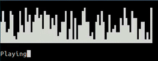

# CSBLOCKS

Draw on terminal using Unicode block elements
Created to learn python :muscle:

# How to run

You only need the grid.py file.

`python
import ...
# Create an instance
grid = Grid()
# Draw a block at (4, 2) (row 4, column 2)
grid.set(4, 2)
# Display
print grid
`

To run the demo (this project):
`
python csblocks.py
`
Or with [virtualenv](http://docs.python-guide.org/en/latest/dev/virtualenvs/):
`
. bin/activate
python csblocks.py 

# turn off
deactivate
`

For details, see the __src/services/visualizer.py__ file.
